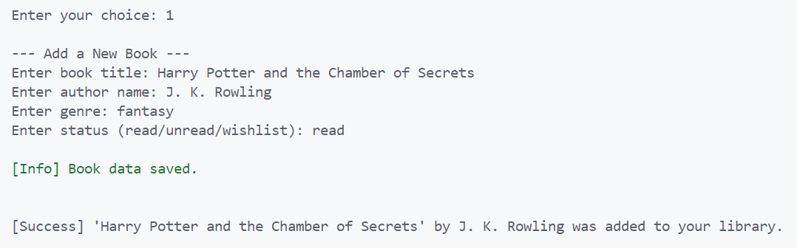

# 📚 MyLibraPy

> 🚀 Try it now on Heroku:  
[**Launch Terminal App**](https://mylibrapy-pp3-3db58ea9dc6b.herokuapp.com)

> 🧠 About this project:  
[About This App](https://mylibrapy-pp3-3db58ea9dc6b.herokuapp.com/about)

```text
  __  __       _      _ _               _____       
 |  \/  |     | |    (_) |             |  __ \      
 | \  / |_   _| |     _| |__  _ __ __ _| |__) |   _ 
 | |\/| | | | | |    | | '_ \| '__/ _` |  ___/ | | |
 | |  | | |_| | |____| | |_) | | | (_| | |   | |_| |
 |_|  |_|\__, |______|_|_.__/|_|  \__,_|_|    \__, |
          __/ |                                __/ |
         |___/                                |___/ 


A simple CLI library manager – built for learning, testing, and practical use in school settings

---

## 🔒 Inspiration From the Classroom

As a teacher at the **European School Karlsruhe**, I constantly explore ways to blend code with everyday school experiences. One of the most practical and relatable topics? **Books.**

This small app grew out of that: a terminal-based tool to help track personal book collections. Students were curious about file handling, persistent data, and terminal UIs – so we started building something together. Not flashy. Not fancy. But it works, and it grows with us.

In parallel, we're also working on a bigger platform: a full-featured **BookExchange** app (database, GUI, server, the works). But **MyLibraPy** is where we try things out. A sandbox. A real-use example. A place where students, colleagues, and I can experiment with real code, for real use.

> “Sir, can we make it print in color?”  
> “Yes. And now we’re importing Colorama.”

This project became part lesson, part library.

---

## ✨ Features

### ✅ Implemented

- 📚 **Add Book**  
  Enter title, author, genre, and status (read/unread/wishlist) – saved to books.json.

- 👀 **View Books**  
  See all your books in a clear, numbered list.

- 🔍 **Search**  
  Search titles, authors, or genres with any keyword.

- ✏️ **Edit Book**  
  Select a book by number and change any field.

- ❌ **Delete Book**  
  Choose a book to delete (with confirmation).

- 📤 **Export to CSV**  
  Write all books to books_export.csv – spreadsheet-ready.

- 📊 **Statistics**  
  Get a breakdown by genre and status, with totals.

- 💾 **Persistent Storage**  
  Your collection is saved between sessions using JSON.

---

## 📚 Demo Library Included

To help testers: the app includes a preloaded demo library with 10 books.
You can immediately press [2] to explore.

## 🖼️ Screenshots

A few glimpses of the interface in use:
- ** Full App Flow (Heroku):**
  

- **Banner / Welcome**:  
  

  - **App Startup (Console View)**:  
  

- **Main Menu**:  
  

- **Add Book Dialog**:  
  

- **Book List View**:  
  

- **Library Statistics**:  
  


---

## 🧪 Manual Testing

All functions were tested in:

- ✅ Windows Terminal (PowerShell & CMD)
- ✅ VS Code terminal
- ✅ Browser via Heroku deployment link
- ✅ Replit deployment
- ✅ flask deployment

### Covered Scenarios:
- Adding new books
- Editing book details
- Deleting entries
- Searching (case-insensitive)
- JSON storage & reload after restart
- CSV export and file verification

### Code Quality:
- Linted using pylint
- Formatted with black

---

## 🐛 Known Issues

- No dropdowns or fixed status choices (user can mistype)
- Genre & status inputs are free text
- No duplication checks yet

---

## 🚀 Run it Yourself

1. Clone this repository:
   
```bash
   git clone https://github.com/freewimoe/MyLibraPy-PP3.git
   cd MyLibraPy-PP3
   pip install -r requirements.txt
   python run.py


2. (Optional) Create a virtual environment:
   
```bash
   python -m venv venv
   venv\Scripts\activate  # Windows
   source venv/bin/activate  # macOS/Linux


3. Install the required package:
   
```bash
   pip install -r requirements.txt


4. Launch the app:
   
```bash
   python main.py


---


## 📦 Dependencies

colorama==0.4.6

---

## 🔮 What’s Next?

- Full GUI (Tkinter or PyQt)
- Multi-user mode with login
- Ratings & personal reviews
- Cloud sync (e.g. Firebase or Supabase)

---

## 🙏 Thanks & Credits

- My **students** at the European School Karlsruhe
- The **Code Institute** for the structured challenge
- [Colorama](https://github.com/tartley/colorama) for terminal color magic
- My mentor **Mo Shami** for valuable guidance
- **Kay Welfare**, my cohort facilitator, for ongoing support

---

## 🔗 Repository

👉 [github.com/freewimoe/MyLibraPy-PP3](https://github.com/freewimoe/MyLibraPy-PP3)

If you're a teacher, student, or just a curious coder – I hope MyLibraPy inspires you like it inspired us in class. 📚✨